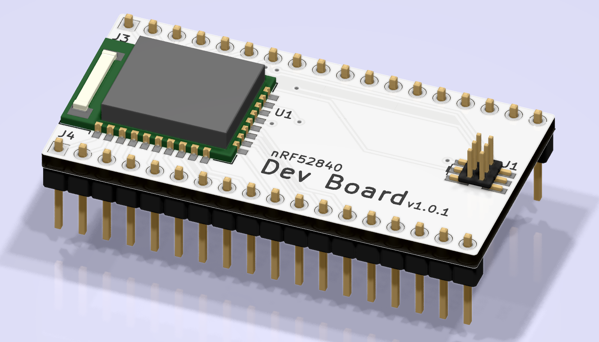

<!--
Add one of this in front of the title

-->

# Dev Board 

<!--
Describe briefly but descritively the device
-->
The board we use to prototype our ideas, this is where it all starts.

## Features

- Breadboard friendly
- USB connection
- SWD Debug adapter

<!--
Features that anyone would understand
Don't mention components or types of components (relays, transistors, etc)
A good example: Makes sandiwiches for free!
A bad example: SSR for quiet/durable operation
-->

<!--
Separatly mention architectural features, be as technical as you can but briefly
mention SSRs, operating frequency, etc
-->

<!--- DON'T CHANGE BELLOW THIS LINE -->

## Not working? Have an improvement idea?
Open an issue or if you're feeling excited submit a pull request! We are always looking for new features and improvements.

## License
You can use this at your will provided that you mention us properly by including a link to this page.
